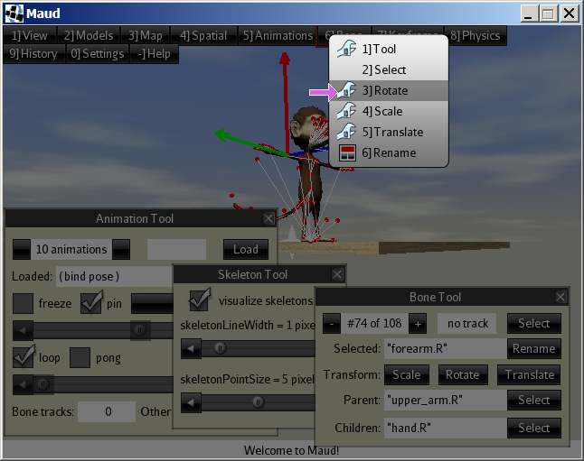
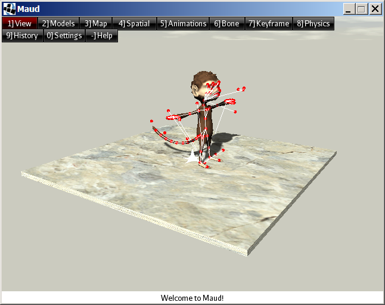

Maud is an editor for the animated 3-D models used by jMonkeyEngine (jME).

Summary of features:
 + import models from Blender/Ogre/Wavefront and save to native J3O format
 + import animations from Biovision Hierarchy assets
 + visualize animations, axes, bones, bounding boxes, skeletons, and physics objects
 + play animations forward/backward at various speeds and pause them
 + add new animations from poses or by altering existing animations
 + retarget animations from one model to another using skeleton maps
 + insert keyframes in animations and bone tracks
 + rename animations, bones, spatials, and user data
 + change animation durations
 + behead/truncate animations
 + reduce/wrap animations and bone tracks
 + delete animations, bone tracks, and keyframes
 + add scene-graph controls and user data to spatials
 + modify spatial transforms (translation, rotation, and scale)
 + modify spatial batch modes, cull hints, render queues, shadow modes, and user data
 + delete scene-graph controls and user data
 + review edit history and undo/redo edits
 + customize mouse-button assignments and keyboard shortcuts
 + complete Java source code provided under a BSD 3-Clause License

Maud was designed for a desktop environment with:
 + a wheel mouse and
 + a display at least 640 pixels wide and 480 pixels tall.

Status as of July 2017: under development, will seek beta testers soon.

### Conventions

Maud's source code is compatible with both JDK 7 and JDK 8.

World coordinate system: the Y axis points upward (toward the zenith).

### History

Since April 2017, the Maud project has been hosted at
https://github.com/stephengold/Maud

Maud began as a demo application for the jme3-utilities-debug library,
part of the jme3-utilities project at
https://github.com/stephengold/jme3-utilities

Maud includes code from the the BVH Retarget Project at
https://github.com/Nehon/bvhretarget

## How to download and install a pre-compiled release of Maud

(Coming soon.)

## How to build Maud from source

### jME Software Development Kit (SDK)

Maud currently targets Version 3.1 of jME.  You are welcome to
use jME without installing its Integrated Development Environment
(IDE), but I use the IDE, and the following
installation instructions assume you will too.

The hardware and software requirements of the SDK are documented at
https://jmonkeyengine.github.io/wiki/jme3/requirements.html

 1. Download a jMonkeyEngine 3.1 SDK from https://github.com/jMonkeyEngine/sdk/releases
 2. Install the SDK, which includes:
   + the engine,
   + the IDE, which is based on NetBeans,
   + various IDE plugins, and
   + the Blender 3D application.
 3. To open the Maud project in the IDE (or in NetBeans), you will need the
    "Gradle Support" plugin.  Download and install it before proceeding.

### Source files

Clone the Maud repository using Git:
 1. Open the Clone wizard in the IDE:
   + Menu bar -> "Team" -> "Remote" -> "Clone..."
 2. For "Repository URL:" specify
    "https://github.com/stephengold/Maud.git" (without the quotes).
 3. Clear the "User:" and "Password:" text boxes.
 4. For "Clone into:" specify a writable folder (on a local filesystem)
    that doesn't already contain "Maud".
 5. Click on the "Next >" button.
 6. Make sure the "master" remote branch is checked.
 7. Click on the "Next >" button again.
 8. Make sure the Checkout Branch is set to "master".
 9. Make sure the "Scan for NetBeans Projects after Clone" box is checked.
10. Click on the "Finish" button.
11. When the "Clone Complete" dialog appears, click on the "Open Project..."
    button.

### Build the project

 1. In the "Projects" window, right-click on the "Maud" project to select it.
 2. Select "Build" or "Run".

## Using Maud

### Overview of the user interface

Maud's user interface is composed 3 screens: "Start", "Editor", and "Bind".
The Start Screen loads first. It merely displays the Maud logo while
initialization completes.  It should automatically transition to the Editor
Screen after a few seconds.

The Editor Screen is Maud's main screen, where 3-D models are viewed
and edited.  There's a menu bar across the top and a message bar at the bottom.
The rest of the user interface
is split into overlapping sub-windows called "tools".

#### Tools

At last count there were 29 tools.
Each tool can be independently hidden or made visible.

Selecting a tool makes it visible and moves it to the top layer for convenient
use, but you can use a tool without it being on top.
The controls in a tool will work even when partly obscured.
You can move a tool by dragging its title bar with the left mouse button (LMB).

If a tool gets in your way, you can hide it by clicking on
the X in its upper right corner with the LMB.
Hiding a tool won't affect anything else, so it's always a safe move.

#### Menus

Clicking on the menu bar with the LMB activates the corresponding menu.
When a menu is active, the remainder of the screen darkens,
and the mouse cursor becomes a right-pointing magenta arrow.
You can then select a menu item by clicking on it with the LMB or RMB.

Some menu items activate submenus.  Others display icons to help describe
what they do:
 + a wrench icon to select a tool
 + a dialog box icon to open a modal dialog box
 + a bone icon to select a bone
 + and so forth.

Menus are context-sensitive, so for instance you'll see many more options
in the Animation menu when an animation is loaded than when the model is
in bind pose.

Many menu items are numbered.  For instance, the first item in the menu bar is
labeled "1] View".  The numbers indicate keyboard shortcuts for
navigating menus.  In other words, you can select the View Menu by pressing
the "1" key on the main keyboard (NOT the "1" key on the numeric keypad).

#### Keyboard shortcuts

Keyboard shortcuts for the Editor Screen include:
 + "E" to deselect the selected bone in a model
 + "." to pause/restart the loaded animation(s)
 + "Esc" to exit from the active menu (or from the Maud application)
 + "X" to create a checkpoint
 + "Z" to undo to the previous checkpoint
 + "Y" to redo to the next checkpoint
 + "F1" to switch to the Bind screen

Mouse-button assignments and keyboard shortcuts can be customized using the
Bind Screen (or by editing the "Interface/bindings/editor.properties" asset
prior to startup)
in which case shortcuts described in this document might not work.

### Views and models in the Editor Screen

At startup, the Editor Screen displays a "scene" view of a single model:
Jaime, from the jme3-testdata library.

A scene view consists of a 3-D render of a loaded model, possibly with a
background, a 3D cursor, a supporting platform, and/or overlaid visualizations.
Visualization can include axes, a bounding box, physics objects, and/or a
skeleton.  If you load and play an animation in a scene view, you'll see the
model's bones move, rather like it would in a game.

When the mouse cursor is in a scene view, you can use the "A" and "D" keys
to rotate the model left and right.  (This won't alter the model itself,
just how it is oriented in the scene.)

The Editor Screen can also display "score" views of loaded animations.
A score view is a schematic, like a musical score, with bones arranged
vertically and time (indicated by a gnomon) progressing from left to right.

While Maud can only edit one model at a time, the Editor Screen can split
in half to display two different models.
(This is useful when retargeting animations from one model to another.)
The model being edited is called the "target" model.
The other model is called the "source" model.

### Views modes of the Editor Screen

The Editor Screen operates in three "view modes", namely:
"Scene Mode", "Score Mode", and "Hybrid Mode".
You can use the backtick key ("`") to cycle through these modes.

<table>
    <tr>
        <th></th>
        <th>With no source model loaded:</th>
        <th>With a source model loaded:</th>
    </tr>
    <tr>
        <td>In Scene Mode...</td>
        <td>A full-width scene view of the target model</td>
        <td>A split screen with a scene view of the source model on the left
            and a scene view of the target model on the right</td>
    </tr>
    <tr>
        <td>In Score Mode...</td>
        <td>A full-width score view of the target model</td>
        <td>A split screen with a score view of the source model on the left
            and a score view of the target model on the right</td>
    </tr>
    <tr>
        <td>In Hybrid Mode...</td>
        <td colspan="2">A split screen with a score view of the target model on the left
            and a scene view of the target model on the right</td>
    </tr>
</table>

### Maud's cameras

Each view has its own camera.
The mouse wheel and middle mouse button (MMB) control Maud's cameras.
Turn the mouse wheel to move a camera forward or backward.
In scene views, drag with MMB to turn the camera.
If score views, drag up/down with MMB to scroll the view down/up.

#### Scene-view cameras

Beyond that, it gets complicated, since scene-view cameras operate in
2 "movement modes" and 2 "projection modes".
The Camera Tool (selected by means of the "View -> Scene" menu)
can be used to select these modes.

"Orbit Mode" is a scene-view camera's default movement mode.
In orbit mode, the camera orbits the "3D cursor" -- typically visible
as a small, white, 6-pointed star at the center of the view.
In orbit mode, turning the camera also changes its location, making it easy to
view models from many directions.

Move the 3D cursor to a new location by clicking LMB on an object in the view:
either the model or its platform.
The 3D cursor doesn't attach to any object, so moving or altering objects
in the scene won't affect the 3D cursor.
The Cursor Tool (selected by means of the View -> Scene menu)
can be used to alter the appearance of the 3D cursor.

"Fly Mode" is a scene-view camera's alternative movement mode.
In fly mode, the camera disregards the 3D cursor, enabling closeups of
locations the 3D cursor can't easily reach, such as the interior
of a model.

"Perspective Mode" is a scene-view camera's default projection mode,
and "Parallel Mode" is the alternative.
In Parallel Mode, the mouse wheel
affects the scale of the projection without actually moving the camera.

Standard keyboard shortcuts affecting the scene-view cameras:
 + "Numpad-1" to move (or rotate) to a horizontal view
 + "Numpad-5" to toggle between perspective and parallel projection modes

#### Score-view cameras

Score views don't have anything analogous to the 3D cursor, but you can
move the score-view camera up/down by clicking LMB where you want it to look.

## 3-D models

As mentioned above, Maud always has a (target) model loaded,
and an additional model (the source model) can also be loaded.
The source model can't be edited; only the target can be edited.

The Model Tool (selected using "Models -> Tool") displays basic
information about the loaded target model.

### Loading (or importing) models from assets

Models are loaded from assets, which can be located either in the
Java classpath or in the filesystem.

Before loading an asset from the filesystem, you must specify
a folder (aka directory) where Maud assets are located:
select "Settings -> Asset folders -> Add",
then navigate to the asset folder (it typically contains a "Model" subfolder),
and select "! add this folder".

To load a new target model, select the "Models -> Load" menu option.

The Model Tool (selected via the Model->Target menu) displays basic
information about the loaded target model.

TODO more

## Next steps

External links:
  + May 2017 demo video:
    https://www.youtube.com/watch?v=fSjsbyBWlPk
  + June 2017 retargeted animation video:
    https://www.youtube.com/watch?v=yRjh1rAsipI

## Acknowledgments

Like most projects, Maud builds on the work of those who went before.
I therefore acknowledge the following software developers:
+ Rémy Bouquet (aka "nehon") for creating the BVH Retarget Project.
+ Paul Speed, for helpful insights that got me unstuck during debugging
+ the creators of (and contributors to) the following software:
  + Adobe Photoshop Elements
  + the Gradle build tool
  + the Blender 3D animation suite
  + the FindBugs source code analyzer
  + the Git revision control system
  + the Google Chrome web browser
  + the Java compiler, standard doclet, and runtime environment
  + jMonkeyEngine and the jME3 Software Development Kit
  + LWJGL, the Lightweight Java Game Library
  + Microsoft Windows
  + the NetBeans integrated development environment
  + the Nifty graphical user interface
  + Open Broadcaster Software
  + the RealWorld Cursor Editor
  + the WinMerge differencing and merging tool

I am grateful to JFrog and Github, for providing free hosting for the
Maud Project and many other open-source projects.

I'm also grateful to my dear Holly, for keeping me sane.

If I've misattributed anything or left anyone out, please let me know so I can
correct the situation.