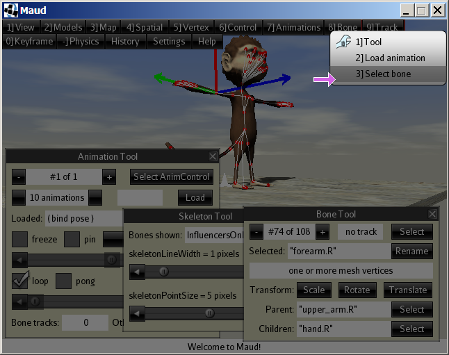

Maud is an editor for the animated 3-D models used by jMonkeyEngine (jME).

Anticipated uses:
 + develop jME animations from motion capture data
 + copy/retarget animations between models
 + convert models in other formats to native J3O format
 + troubleshoot issues with models (or with your model-asset pipeline)

Summary of features:
 + import models from Blender/Ogre/Wavefront and save to native J3O format
 + import animations from Biovision Hierarchy (BVH) assets
 + visualize animations, axes, bones, bounding boxes, skeletons, and physics objects
 + play animations forward/backward at various speeds and pause them
 + add new animations from poses or by altering existing animations
 + retarget animations from one model to another using skeleton maps
 + insert keyframes in animations and bone tracks
 + rename animations, bones, spatials, and user data
 + change animation durations
 + behead/truncate animations
 + reduce/wrap animations and bone tracks
 + delete animations, bone tracks, and keyframes
 + add scene-graph controls and user data to spatials
 + modify spatial transforms (translation, rotation, and scale)
 + modify spatial batch modes, cull hints, render queues, shadow modes, and user data
 + delete scene-graph controls and user data
 + review an unlimited edit history and undo/redo edits
 + customize mouse-button assignments and keyboard shortcuts
 + complete Java source code provided under a BSD 3-Clause License

Maud was designed for a desktop environment with:
 + a wheel mouse and
 + a display at least 640 pixels wide and 480 pixels tall.

Status as of August 2017: seeking alpha testers.

## How to download and install a pre-built release of Maud

1. Find the release you want in the webpage at
   https://github.com/stephengold/Maud/releases
2. Download the appropriate ZIP file for your platform.
   (For a 64-bit Windows platform, download "Maud-Windows-x64.zip".)
3. Extract the contents of the ZIP file.
4. Open/run the Maud executable/application in the extracted folder/directory.
   (In Windows, open "Maud.exe" in the "Maud" subfolder.)

## How to build Maud from source

### jME Software Development Kit (SDK)

Maud currently targets Version 3.1 of jME.  You are welcome to
use jME without installing its Integrated Development Environment
(IDE), but I use the IDE, and the following
installation instructions assume you will too.

If you already have the IDE installed, skip to step 6.

The hardware and software requirements of the SDK are documented at
https://jmonkeyengine.github.io/wiki/jme3/requirements.html

 1. Download a jMonkeyEngine 3.1.0 Stable SDK installer from https://github.com/jMonkeyEngine/sdk/releases
 2. Install the SDK, which includes:
   + the engine,
   + the IDE, which is based on NetBeans,
   + various IDE plugins, and
   + the Blender 3D application.
 3. When you execute the installer, it prompts you to
    specify a folder for storing projects:
   + Fill in the "Folder name" text box.
     (The choice doesn't seem to matter much.)
   + Click on the "Set Project Folder" button.
 4. Open the IDE.
 5. The first time you open the IDE, you should update
    all the pre-installed plugins:
   + Menu bar -> "Tools" -> "Plugins" to open the "Plugins" dialog
   + Click on the "Update" button to open the "Plugin Installer" wizard.
   + Click on the "Next >" button.
   + After the plugins have downloaded, click "Finish".
   + The IDE will restart.
 6. In order to open the Maud project in the IDE (or in NetBeans),
    you will need to install the "Gradle Support" plugin:
   + Menu bar -> "Tools" -> "Plugins" to open the "Plugins" dialog
   + Click on the "Available Plugins" tab.
   + Check the box next to "Gradle Support" in the "Gradle" category.
   + Click on the "Install" button to open the the "Plugin Installer" wizard.
   + Click on the "Next >" button.
   + Check the box next to
     "I accept the terms in all the license agreements."
   + Click on the "Install" button.
   + When the "Verify Certificate" dialog appears,
     click on the "Continue" button.
   + Click on the "Finish" button.
   + The IDE will restart.

### Source files

Clone the Maud repository using Git:
 1. Open the "Clone Repository" wizard in the IDE:
    Menu bar -> "Team" -> "Git" -> "Clone..."
 2. For "Repository URL:" specify
    "https://github.com/stephengold/Maud.git" (without the quotes).
 3. Clear the "User:" and "Password:" text boxes.
 4. For "Clone into:" specify a writable folder (on a local filesystem)
    that doesn't already contain "Maud".
 5. Click on the "Next >" button.
 6. Make sure the "master" remote branch is checked.
 7. Click on the "Next >" button again.
 8. Make sure the Checkout Branch is set to "master".
 9. Make sure the "Scan for NetBeans Projects after Clone" box is checked.
10. Click on the "Finish" button.
11. When the "Clone Completed" dialog appears, click on the "Open Project..."
    button.

### Build the project

 1. In the "Projects" window of the IDE,
    right-click on the "Maud" project to select it.
 2. Select "Build" or "Run".

## Using Maud

### Overview of the user interface

Maud's user interface consists of 3 screens: "Start", "Editor", and "Bind".
The Start Screen loads first. It merely displays the Maud logo while
initialization completes.  It should automatically transition to the Editor
Screen after a few seconds.

The Editor Screen is Maud's main screen, where 3-D models are viewed
and edited.  There's a menu bar across the top and a message bar at the bottom.
The rest of the user interface
is split into overlapping sub-windows called "tools".

#### Tools

At last count, Maud had 30 tools.
Each tool can be independently hidden or made visible.

Selecting a tool makes it visible and moves it to the top layer for convenient
use, but you can use a tool without it being on top.
The controls in a tool will work even when partly obscured.
You can move a tool by dragging its title bar with the left mouse button (LMB).

If a tool gets in your way, you can hide it by clicking on
the X in its upper right corner with the LMB.
Hiding a tool won't affect anything else, so it's always a safe move.

#### Menus

Clicking on the menu bar with the LMB activates the corresponding menu.
When a menu is active, the remainder of the screen darkens,
and the mouse cursor becomes a right-pointing magenta arrow.
You can then select a menu item by clicking on it with the LMB or RMB.

Some menu items activate submenus.  Others display icons to help describe
what they do:
 + a wrench icon to select a tool
 + a dialog box icon to open a modal dialog box
 + a bone icon to select a bone
 + and so forth.

Menus are context-sensitive, so for instance you'll see many more options
in the Animation menu when an animation is loaded than when the model is
in bind pose.

Many menu items are numbered.  For instance, the first item in the menu bar is
labeled "1] View".  The numbers indicate keyboard shortcuts for
navigating menus.  In other words, you can select the View Menu by pressing
the "1" key on the main keyboard (NOT the "1" key on the numeric keypad).

#### Keyboard shortcuts

Keyboard shortcuts for the Editor Screen include:
 + "E" to deselect the selected bone in a model
 + "." to pause/restart the loaded animation(s)
 + "Esc" to exit from the active menu (or from the Maud application)
 + "X" to create a checkpoint
 + "Z" to undo to the previous checkpoint
 + "Y" to redo to the next checkpoint
 + "F1" to switch to the Bind screen

Mouse-button assignments and keyboard shortcuts can be customized using the
Bind Screen (or by editing the "Interface/bindings/editor.properties" asset
prior to startup)
in which case shortcuts described in this document might not work.

### Views and models in the Editor Screen

At startup, the Editor Screen displays a "scene" view of a single model:
Jaime, from the jme3-testdata library.

A scene view consists of a 3-D render of a loaded model, possibly with a
background, a 3D cursor, a supporting platform, and/or overlaid visualizations.
Visualization can include axes, a bounding box, physics objects, and/or a
skeleton.  If you load and play an animation in a scene view, you'll see the
model's bones move, rather like it would in a game.

When the mouse cursor is in a scene view, you can use the "A" and "D" keys
to rotate the model left and right.  (This won't alter the model itself,
only its orientation in scene views.)

The Editor Screen can also display "score" views of loaded animations.
A score view is a schematic, like a musical score, with bones arranged
vertically and time (indicated by a gnomon) progressing from left to right.

While Maud can only edit one model at a time, the Editor Screen can split
in half to display two different models.
(This is useful when retargeting animations from one model to another.)
The model being edited is called the "target" model.
The other model is called the "source" model.

### Views modes of the Editor Screen

The Editor Screen operates in three "view modes", namely:
"Scene Mode", "Score Mode", and "Hybrid Mode".
You can select a view mode using the "View -> Mode" submenu or
use the backtick ("`") keyboard shortcut to cycle through these modes.

<table>
    <tr>
        <th></th>
        <th>With no source model loaded:</th>
        <th>With a source model loaded:</th>
    </tr>
    <tr>
        <td>In Scene Mode...</td>
        <td>A full-width scene view of the target model</td>
        <td>A split screen with a scene view of the source model on the left
            and a scene view of the target model on the right</td>
    </tr>
    <tr>
        <td>In Score Mode...</td>
        <td>A full-width score view of the target model</td>
        <td>A split screen with a score view of the source model on the left
            and a score view of the target model on the right</td>
    </tr>
    <tr>
        <td>In Hybrid Mode...</td>
        <td colspan="2">A split screen with a score view of the target model on the left
            and a scene view of the target model on the right</td>
    </tr>
</table>

### Maud's cameras

Each view has its own camera.
The mouse wheel and middle mouse button (MMB) control Maud's cameras.
Turn the mouse wheel to move a camera forward or backward.
In scene views, drag with MMB to turn the camera.
In score views, drag up/down with MMB to scroll the view down/up.

#### Scene-view cameras

Beyond that, it gets complicated, since scene-view cameras operate in
2 "movement modes" and 2 "projection modes".
The "Camera Tool" (selected using "View -> Scene options -> Camera")
can be used to select these modes.

"Orbit Mode" is a scene-view camera's default movement mode.
In orbit mode, the camera orbits the "3D cursor" -- typically visible
as a small, white, 6-pointed star at the center of the view.
In orbit mode, turning the camera also changes its location, making it easy to
view models from many directions.

Move the 3D cursor to a new location by clicking LMB on an object in the view:
either the model or its platform.
The 3D cursor doesn't attach to any object, so moving or altering objects
in the scene won't affect the 3D cursor.
The "Cursor Tool" (selected using "View -> Scene options -> Cursor")
can alter the appearance of the 3D cursor.

"Fly Mode" is a scene-view camera's alternative movement mode.
In fly mode, the camera disregards the 3D cursor, enabling closeups of
locations the 3D cursor can't easily reach, such as the interior
of a model.

"Perspective Mode" is a scene-view camera's default projection mode,
and "Parallel Mode" is the alternative.
In Parallel Mode, the mouse wheel
affects the scale of the projection without actually moving the camera.

Standard keyboard shortcuts affecting the scene-view cameras:
 + "Numpad-1" to move (or rotate) to a horizontal view
 + "Numpad-5" to toggle between perspective and parallel projection modes

#### Score-view cameras

Score views don't have anything analogous to the 3D cursor, but you can
move the score-view camera up/down by clicking LMB where you want it to look.

## 3-D models

As mentioned above, Maud always has a (target) model loaded,
and an additional model (the source model) can also be loaded.
The source model can't be edited; only the target can be edited.

The "Model Tool" (selected using "Models -> Tool") displays basic
information about the loaded target model.

### Loading (or importing) models from assets

Models are loaded from assets, which can be located either in the
Java classpath or in the filesystem.

Before loading an asset from the filesystem, you must specify
a folder (aka directory) where Maud assets are located:
select "Settings -> Asset folders -> Add",
then navigate to the asset folder (it typically contains a "Model" subfolder),
and select "! add this folder".

To load a new target model, select the "Models -> Load" menu item,
then select an asset folder, then navigate to the model file.
To load a new source model, select "Models -> Source model -> Load",
then select an asset folder, then navigate to the model file.

Maud can of course load models in jME's native binary format.
To be recognized, such models must have filenames ending in ".j3o".

Maud can also import models in other formats:
 + Blender 3D (filename must end in ".blend")
 + Ogre DotScene (filename must end in ".scene")
 + Ogre XML (filename must end in ".mesh.xml")
 + Wavefront OBJ (filename must end in ".obj")

In addition, Biovision Hierarchy animations can be imported as models.
To be recognized, the the filename name must end in ".bvh".
The imported model will consist of a single node without any geometries.

### Saving the target model

To write the target model to a file in jME's native binary format,
open the save dialog: "Models -> Save".
Modify the base file path as desired, and click on the "Save" button.
The suffix ".j3o" is automatically appended to the base file path.

By default, models loaded from the classpath will be written to a
"Written assets" folder under the application's working folder.
Maud treats this asset folder as if it were part of the classpath.

## Bones

In jME, "bones" are named parts of a 3D model that can influence the positions
of vertices in that model's meshes.
A vertex can be influenced by up to 4 bones.
A bone can also influence other bones, called its "children".
A bone with no children is a "leaf" bone.
A bone with no parent is a "root" bone.

Each bone has a "head" around which it pivots.
However a jME bone need not have a well-defined "tail", a length,
or even a direction.

In a scene view, Maud visualizes each bone as a round dot
(red or green by default)
connected to its children by lines (white by default).
(You can customize these colors using the "Skeleton Color Tool":
"View -> Scene options -> Skeleton color".)

In a score view, each bone is represented by horizontal "staff".
If space permits, the staff includes a rectangular name label on the left.
If the bone is tracked (more about that later) the staff also includes
up to 10 stacked "sparklines" bracketed by a pair of "finials".
The sparklines, rendered in four colors, represent animation data,
and the finials help distinguish which sparkline is which.

Before editing a bone in Maud, you must "select" it.
In a scene view, the selected bone (if any) is typically indicated by
three arrows, denoting the axes of its local coordinate space.
In a score view, the selected bone is indicated by dark finials and a
dark background for its name label.

The "Bone Tool" (selected using "Bone -> Tool") controls the target model's
selected bone.

### Selecting bones

Maud offers many ways to select a bone.

The "Bone -> Select" submenu enables you to select bones in the
target model by name:
 + from among all bones in the selected skeleton, or
 + from among the root bones in that skeleton, or
 + from among all bones with tracks in the loaded animation, or
 + from among the children of the selected bone.
It also enables you to navigate the bone hierarchy "by parent"
or step through bones in numerical order ("Previous" and "Next").

The Bone Tool provides more convenient interfaces to these same
selection options.

The quickest way to select a bone is to click the the right mouse
button (RMB) on it.
This works in both scene views and in score views, and
for both the source model and the target model.
However, since bones can appear very close together in scene views,
and since the RMB is also used to select objects other than bones,
use caution with this technique.

## Animations

In jME, "animations" are named parts of a 3D model, each with its own duration.
In addition, Maud treats the model's bind pose as a zero-duration
animation for most purposes.

Real jME animations are made up of "tracks", usally bone tracks.
Each bone track controls the local transform of a single bone.
An animation need not include a track for every bone.
Maud refers to bones that have tracks in the loaded animation
as "tracked bones".

Each track is composed of series of "keyframes", starting at time zero.

The Animation Tool (selected using "Animations -> Tool")
controls the target model's loaded animation.
There's also a Source Animation Tool ("Animations -> Source tool")
to control the source model's loaded animation.

### Loading animations

In Maud, "loading" an animation means selecting it
for visualization, playback, and/or editing.

To load an animation for the target model,
select "Animations -> Load" and then the name of the animation.
To load an animation for the source model,
select "Animations -> Load source" and then the name of the animation.

### Playing, pausing, and pinning animations

Once an animation is loaded, Maud can play it forward or backward at speeds
of up to 2x.
Each animation tool has a slider to control the speed and direction
of playback.

Each animation tool also has a button to pause/resume the loaded animation.
As mentioned above, you can also use the "." keyboard shortcut
to pause/resume loaded animations.

By default, Maud "loops" to the start (or end) of the loaded animation
when playback reaches the animation's end (or start).
Using the animation tools, you can instruct Maud to pause and/or reverse
direction ("pong") instead.

Using the animation tools, you can also "pin" a loaded animation.
Pinning an animation keeps its root bone(s) at the model origin
for display (scene view) purposes.

## The pose

While an animation is playing on the target model, Maud typically refreshes
the displayed bone transforms on every frame.
Once the animation is paused, however, the target model's bone transforms
become a new object (called the "pose") that can be modified independent
of the loaded animation.

Use the "Bone-Translation Tool" ("Bone -> Translate") to modify the local
translation of the selected bone in the pose.
Use the "Bone-Scale Tool" ("Bone -> Scale") to scale
the selected bone in the pose.
And use the "Bone-Rotation Tool" ("Bone -> Rotate") to rotate
the selected bone in the pose.

In a scene view, you can also rotate the selected bone by grabbing
any of the bone's 3 axis arrows with the RMB and dragging with the mouse.
The axis arrows are constrained to an invisible sphere surrounding the
selected bone's head, so for many mouse-pointer screen locations,
2 axis directions are possible.
While you're dragging a bone axis, Maud remembers whether the axis
inclines toward the camera or away from it.
You can toggle this inclination using the "S" shortcut key.

The pose has many uses.  For instance:
To create a new, zero-length animation from the pose,
select "Animations -> Add new -> Pose".
To insert keyframes (and replace any pre-existing keyframes)
at the current time in the loaded animation,
select "Animations -> Insert keyframes".
To insert a keyframe (or replace the pre-existing keyframe)
at the current time in the selected bone track,
select "Keyframe -> Insert from pose".
To replace all keyframes in the selected bone
track, use the "Set all to pose" buttons in the "Keyframe Tool"
("Keyframe -> Tool").

You can use the pose like a paste buffer, to copy bone transforms
from one time to another.
For this to work, you must "freeze" the pose so Maud won't
overwrite it as soon as you change the animation time.
To freeze the pose, either tick the "freeze" check box in the Animation Tool
or use the "F" keyboard shortcut.
Then go to the animation time when you want to paste and select
"Keyframe -> Insert from pose" (to paste a single keyframe)
or "Animations -> Insert keyframes" (to paste multiple keyframes).
Remember to unfreeze the pose after you finish!

## Skeleton maps

Once an animation is created for one model, it's a simple matter to
copy it to another model, provided both models use the exact same
skeleton.

To retarget animations between models with different skeletons, Maud
requires a "skeleton map" to match bones in the source model with
corresponding ones in the target model.
(Corresponding bones may have different names and/or indices.)

Furthermore, since jME bones don't have defined tails,
it's often necessary to adjust bone orientations when retargeting
animations between models.
To automate these adjustments, each bone mapping in a jME skeleton
map includes a "twist" value.

Maud has the capability to load skeleton maps from assets, edit
them, save them, and use them to retarget animations.
Sample skeleton maps are provided, such as "SinbadToJaime" which
maps Sinbad's skeleton to that of Jaime.

The "Mapping Tool" ("Map -> Tool") is useful for loading and
editing skeleton maps.
To do anything with a skeleton map, you must have a source model loaded.
To add a new mapping between 2 bones, select the source bone in the source
model and the target bone in the target model, then click LMB on
the "Map" button in the lower left or use the equals ("=") keyboard shortcut.

As long as the 2 selected bones map to each other in the loaded map,
Maud considers that the corresponding bone mapping is selected.
You can unmap the selected bone mapping (with the "Unmap" button) or
adjust its twist value with the "Twist Tool" ("Map -> Twist Tool").

When editing a skeleton map, it's helpful to see
its effect on the target model in real time.
To do this, click LMB on the "Show retargeted pose" button in the Mapping Tool or
select "Animations -> Load -> (retargeted pose)".
With this pseudo-animation loaded:
 + changing the source pose automatically updates the target pose,
 + changing the skeleton map automatically updates the target pose,
 + selecting a mapped source bone also selects the corresponding target bone, and
 + dragging axes of the target bone automatically updates the twist value of the selected bone mapping.

When you're ready to retarget animations between models,
use the "Retarget Tool" ("Animations -> Add new -> Retarget").

## The edit history

Like any serious editor, Maud provides an "undo" capability.

Maud's undo capability is based on checkpointing the editor's state.
Tool visibility and positioning are not checkpointed, nor are shortcut
key bindings, but nearly everything else is, including the view mode,
view options, loaded models, maps, and animations, and selections.

You can create a checkpoint at any time using the "X" keyboard shortcut
or the "New checkpoint" button in the "History Tool" ("History -> Tool").
To undo changes since the most recent checkpoint, use the "Z" keyboard shortcut.

To safeguard your work since the last checkpoint,
the "Z" key usually creates a new checkpoint as well.
That allows you to to redo any changes you've undone
by using the "Y" keyboard shortcut.

Maud places no limit on the number of checkpoints you can create/undo/redo.
To help you visualize and navigate your edit history,
Maud provides a "History Tool" ("History -> Tool").

## External links

YouTube videos about Maud:
  + May 2017 demo video (out-of-date!):
    https://www.youtube.com/watch?v=fSjsbyBWlPk
  + June 2017 retargeted animation video:
    https://www.youtube.com/watch?v=yRjh1rAsipI

BVH resources:
  + BVH format description:
    http://research.cs.wisc.edu/graphics/Courses/cs-838-1999/Jeff/BVH.html
  + free motion capture data from Ohio State University's ACCAD:
    http://accad.osu.edu/research/mocap/mocap_data.htm
  + motion capture data from Motcap.com (registration required):
    http://motcap.com/

## Wishlist

Maud is incomplete.
The following features are on my "to do" list, in no particular order:
 + advance/delay keyframe(s)
 + better support for physics controls/objects
 + smooth camera motion
 + tools for Lights/Materials/Meshes
 + select the keyframe closest to the current animation time
 + automatically create a checkpoint before every edit/unload
 + tweening options for animations
 + select bone mappings that don't correspond to the loaded models
 + export a model to OBJ format
 + export an animation to BVH format
 + identify useless bones/nodes
 + import a model from Xbuf format
 + import/load assets from JAR/ZIP archives
 + localization
 + more scene-view options for platform/sky
 + blend/concatenate animations
 + tool tips
 + mirror an animation/pose
 + remember asset folders and tool positions from the previous invocation of Maud
 + confirm before overwriting a file
 + preserve a frozen pose when loading an animation

## Conventions

Maud's source code is compatible with both JDK 7 and JDK 8.

World coordinate system: the Y axis points upward (toward the zenith).

## History

Since April 2017, the Maud project has been hosted at
https://github.com/stephengold/Maud

Maud began as a demo application for the jme3-utilities-debug library,
part of the jme3-utilities project at
https://github.com/stephengold/jme3-utilities

Maud includes code from the the BVH Retarget Project at
https://github.com/Nehon/bvhretarget

## Acknowledgments

Like most projects, Maud builds on the work of those who went before.
I therefore acknowledge the following artists and software developers:
+ Rémy Bouquet (aka "nehon") for creating the Jaime model and the BVH Retarget
  Project and also for many helpful insights
+ Paul Speed (aka "pspeed") for many helpful insights
+ Zi Ye, for creating the Sinbad model
+ the brave souls who volunteered to be alpha testers for Maud, including:
  + "Jesterrrrrr"
+ the creators of (and contributors to) the following software:
  + Adobe Photoshop Elements
  + the Blender 3D animation suite
  + the FindBugs source-code analyzer
  + the Git revision-control system
  + the GitK commit viewer
  + the Google Chrome web browser
  + the Gradle build tool
  + the Java compiler, standard doclet, and runtime environment
  + jMonkeyEngine and the jME3 Software Development Kit (SDK)
  + LWJGL, the Lightweight Java Game Library
  + Microsoft Windows
  + the NetBeans integrated development environment
  + the Nifty graphical user interface
  + Open Broadcaster Software
  + the RealWorld Cursor Editor
  + the WinMerge differencing and merging tool

I am grateful to JFrog and Github, for providing free hosting for the
Maud Project and many other open-source projects.

I'm also grateful to my dear Holly, for keeping me sane.

If I've misattributed anything or left anyone out, please let me know so I can
correct the situation.